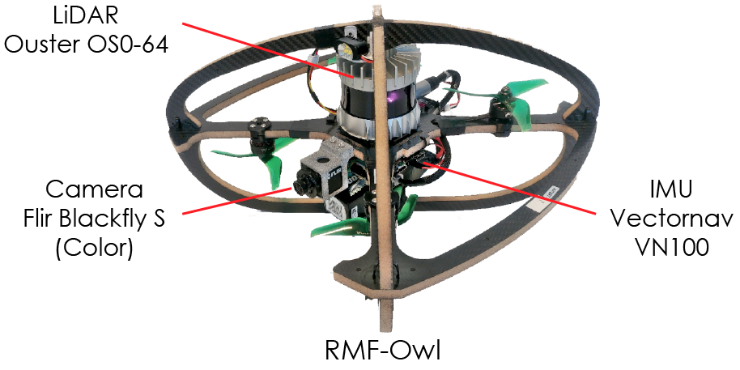
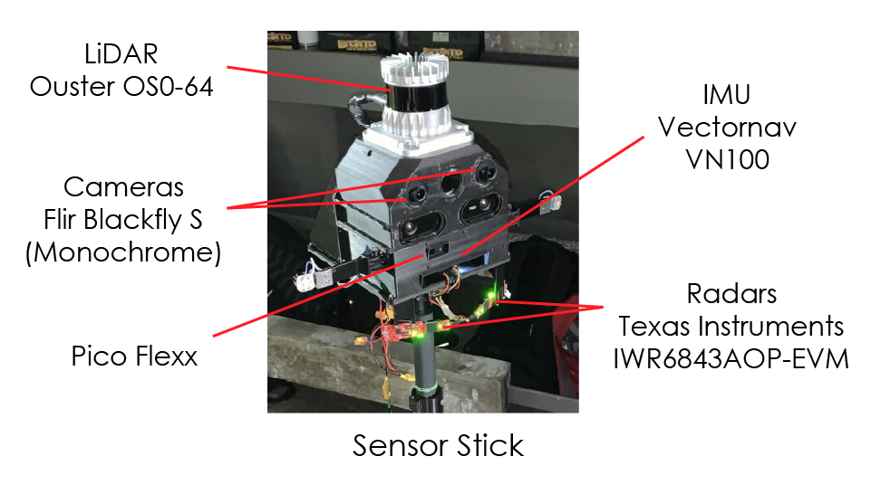

# Ballast Water Tank Dataset

This repository contains the dataset collected from ballast tanks across three vessels. To maintain anonymity, the ships will be reffered to as "FPSO1", "FPSO2", and "Oil Tanker".

The dataset is collected using two platforms namely, [RMF-Owl](https://ieeexplore.ieee.org/document/9836115) a collision-tolerant aerial robot, and a handheld sensor setup. The dataset for RMF-Owl consists of flights from autonomous exploration and inspection missions detailed (and beyond) in the corresponding publication ([link](https://arxiv.org/abs/2311.03838)) as well as additional manual flights.

# Equipment Description

RMF-Owl | Sensor Stick 
|:-------------------------:|:-------------------------:|
|  |   |
|[Dataset](./rmf-owl.md) | [Dataset](./sensor_stick.md)|

## Sensor Setup
Sensor  | RMF-Owl         | Sensor Stick               
:------:|:---------------:|:---------------------:
LiDAR   | [Ouster OS0-64 (Rev-D)](https://ouster.com/products/hardware/os0-lidar-sensor)   | [Ouster OS0-64 (Rev-D)](https://ouster.com/products/hardware/os0-lidar-sensor)        
Camera*  | [Flir Blackfly S 0.4MP Color](https://www.flir.eu/products/blackfly-s-usb3/?vertical=machine+vision&segment=iis) | [Flir Blackfly S 0.4MP Mono](https://www.flir.eu/products/blackfly-s-gige/?model=BFS-PGE-04S2M-CS&vertical=machine+vision&segment=iis) (x2)   
IMU     | [Vectornav VN100](https://www.vectornav.com/products/detail/vn-100) | [Vectornav VN100](https://www.vectornav.com/products/detail/vn-100)   
Radar   | -               | [Texas Instruments IWR6843AOP-EVM Radar](https://www.ti.com/tool/IWR6843AOPEVM)

*For data privacy reasons the faces of people in the images are blurred.
