# Dataset from RMF-Owl

RMF-Owl was deployed in all three ships in autonomous and manual flights.

## Topics in the dataset

### Sensors

| Sensor  | Topic                   | Datatype                  | Rate |
| ---     | ---                     | ---                       | --- |
| LiDAR   | `/os_cloud_node/points` | `sensor_msgs/PointCloud2` | `10 Hz` |
|    | `/os_cloud_node/lidar_packets` | `ouster_ros/PacketMsg` | - |
|    | `/os_cloud_node/imu_packets` | `ouster_ros/PacketMsg` | - |
| Color Camera  | `/blackfly_image/compressed`       | `sensor_msgs/CompressedImage`       | `20 Hz` |
|   | `/blackfly_image_mask/compressed`       | `sensor_msgs/CompressedImage`       | `20 Hz` |
|   | `/blackfly_image/camera_info`       | `sensor_msgs/CameraInfo`       | `20 Hz` |
| IMU (compensated) | `/vectornav_node/imu`       | `sensor_msgs/Imu`       | `200 Hz` |
| IMU (uncompensated) | `/vectornav_node/uncomp_imu`       | `sensor_msgs/Imu`       | `200 Hz` |

**Note: Due to data privacy reasons, the faces of all people in the images are blurred. In order to avoid issues caused by this, a mask image marking the pixels in the corresponding camera images that were blurred is provided on the topic `/blackfly_image_mask/compressed`.**

### Onboard SLAM

| Description   | Topic                   | Datatype                  | Rate |
| ---           | ---                     | ---                       | --- |
| LiDAR only SLAM (using [[1]](https://ieeexplore.ieee.org/document/9213865)) | `/compslam/odometry` | `nav_msgs/Odometry` | `5 Hz` |
| LiDAR odometry fused with IMU | `/msf_core/odometry` | `nav_msgs/Odometry` | `200 Hz` |
| Robot's path | `/laser_mapping_path` | `nav_msgs/Path` | `5 Hz` |

### Path Planning

| Description   | Topic                   | Datatype                  |
| ---           | ---                     | ---                       |
| Commanded trajectory | `/command/trajectory` | `trajectory_msgs/MultiDOFJointTrajectory` |
| Commanded trajectory visualization marker | `/pci_command_trajectory_vis` | `visualization_msgs/MarkerArray` |

### Other

| Topic | Description | Datatype                  |
| ---           | ---                     | ---                       |
| `/tf_static` | Transformations between each the frames of all sensors | tf2_msgs/TFMessage |

### Intrinsics and Extrinsics

+ **The camera instrinsics calibration is published on the topic `/blackfly_image/camera_info` as `sensor_msgs/CameraInfo` messages.**
+ **All the transformations between the sensor are available as [`tf/tfMessage`](https://docs.ros.org/en/noetic/api/tf/html/msg/tfMessage.html) on the topic `/tf_static`.**

## Data Description

### Entire RMF Dataset [here](https://ntnu.box.com/s/tbaurg4k7t2wrysxqswsubesf97cog75)

### FPSO1 ([Whole Dataset](https://ntnu.box.com/s/qcf8inzkpo9phebxibu24vdy8dg3mju7))

The dataset covers two identical levels of the ballast tank. Each level had 5 compartments connected by large opennings.

#### Autonomous Mission 1

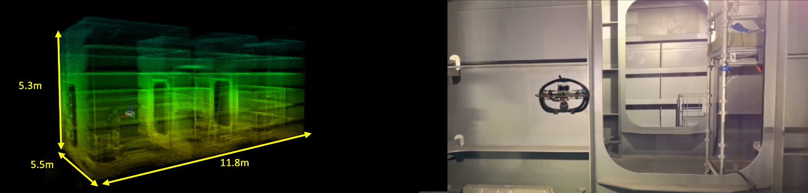

| | |
| ---- | ---- |
| Description | Autonomous exploration and inspection of `3` compartments of **level 1** of the ballast tank. Flying height restrictrected to `3m`. |
| Mission Time | 225s |
| Light Conditions | Onboard   - Yes |
|                  | External  - Yes |
|                  | Note: Bright external light shines into the camera in several frames. |

[**Link to DATASET**](https://ntnu.box.com/s/hdm60to0aaqghnh5cf7qnowqthjnta1n)

#### Autonomous Mission 2

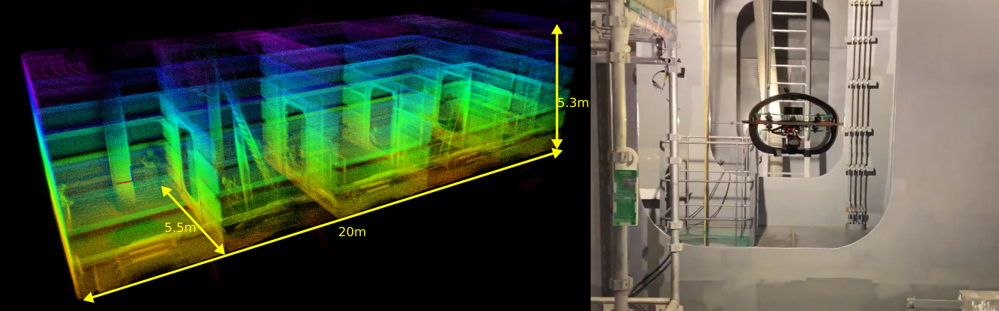

| | |
| ---- | ---- |
| Description | Autonomous exploration and inspection of `5` compartments of **level 1** of the ballast tank. Flying height restrictrected to `3m`. |
| Mission Time | 300s |
| Light Conditions | Onboard   - Yes |
|                  | External  - Yes |
|                  | Note: Bright external light shines into the camera in several frames. |

[**Link to DATASET**](https://ntnu.box.com/s/gca2iv9b8dy9wd82sxeioe8yvtaq2a1x)  

#### Autonomous Mission 3

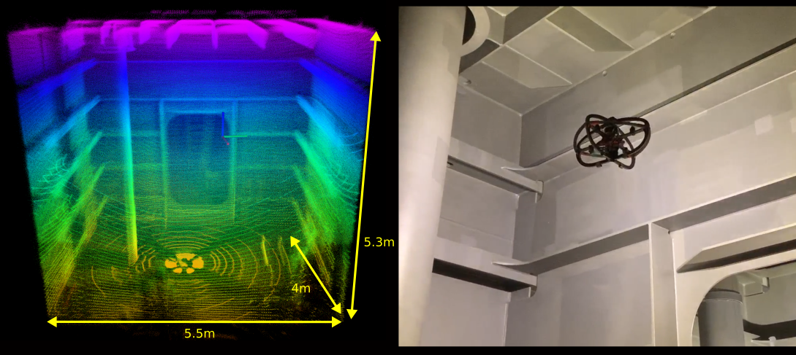

| | |
| ---- | ---- |
| Description | Autonomous exploration and inspection of `1` compartment of **level 1** of the ballast tank. Unrestrictrected flying height. |
| Mission Time | 154s |
| Light Conditions | Onboard   - Yes |
|                  | External  - Yes |
|                  | Note: Bright external light shines into the camera in several frames. |

[**Link to DATASET**](https://ntnu.box.com/s/pfhif7dh28e8an0bv7gu00c287npo4we)

#### Manual Flight 1

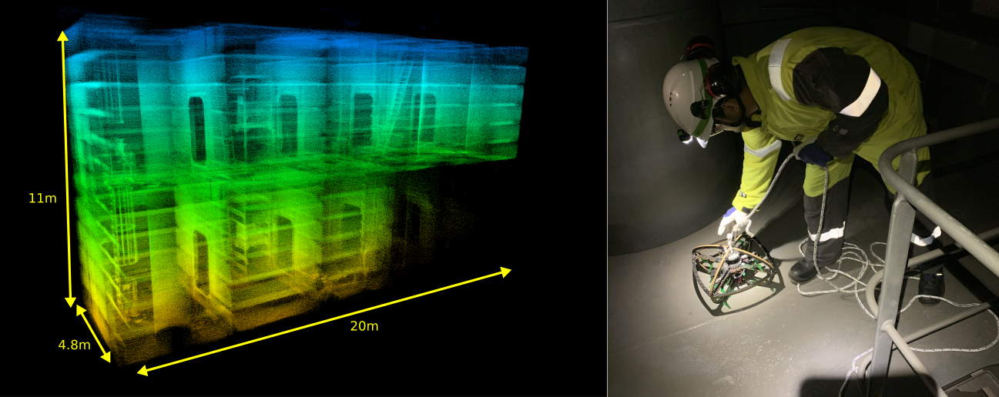

| | |
| ---- | ---- |
| Description | Robot was manually flown on **level 2**, landed, pulled up to **level 1** by a rope, and flown on **level 1**. |
| Mission Time | 450s |
| Light Conditions | Onboard   - No |
|                  | External  - Yes |
|                  | Note: Due to no onboard lighting, some camera frames are dark. |

[**Link to DATASET**](https://ntnu.box.com/s/xb4syqw7mlhfc1wwpemiygrihhpzikx3)

### FPSO2 ([Whole Dataset](https://ntnu.box.com/s/d8zm686e9naa0sgd8o7gmc10amqmrqm8))

The dataset covers missions across four different sections of the ballast tank. The missions involve autonomous exploration and inspection missions along with manual flights with the robot flying through manhole across level.

#### Autonomous Mission 1

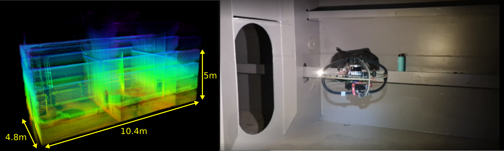

| | |
| ---- | ---- |
| Description | Autonomous exploration and inspection of `3` compartments of **level 1** of the ballast tank passing through manholes of dimensions `1.3 x 0.6m`. Flying height restrictrected to `3m`. |
| Mission Time | 300s |
| Light Conditions | Onboard   - Yes |
|                  | External  - No (only headlights of people present in the tank) |
|                  | Note: Reflection of onboard lights on the metal surfaces can be seen in some frames. |

[**Link to DATASET**](https://ntnu.box.com/s/ouaz7xe4fk19x8o9l6l266j9vplrvf4o)

#### Autonomous Mission 2

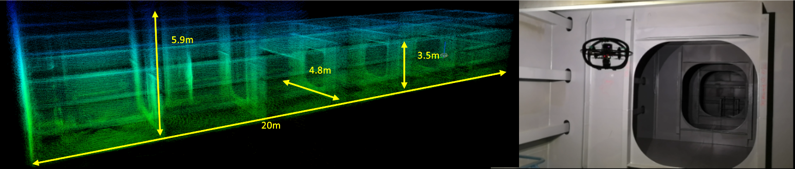

| | |
| ---- | ---- |
| Description | Autonomous exploration and inspection of `6` compartments of **level 2** of the ballast tank. Flying height restrictrected to `3m`. |
| Mission Time | 380s |
| Light Conditions | Onboard   - Yes |
|                  | External  - No (only headlights of people present in the tank) |
|                  | Note: Reflection of onboard lights on the metal surfaces can be seen in some frames. |

[**Link to DATASET**](https://ntnu.box.com/s/4t8llwaf673t4r6r1pd78jzw8d8h73ge)

#### Autonomous Mission 3

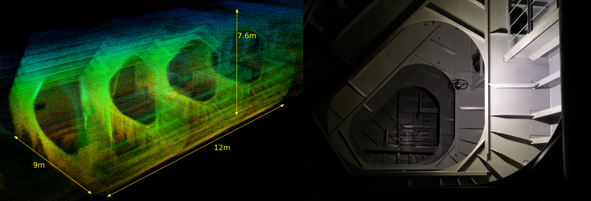  

| | |
| ---- | ---- |
| Description | Autonomous exploration and inspection of `3` compartments of the bilge section of **level 4** of the ballast tank. |
| Mission Time | 336s |
| Light Conditions | Onboard   - Yes |
|                  | External  - No (only headlights of people present in the tank) |
|                  | Note: Reflection of onboard lights on the metal surfaces can be seen in some frames. |

[**Link to DATASET**](https://ntnu.box.com/s/z06enxo06p5um891otaizn7ps7mw8hsb)

#### Autonomous Mission 4

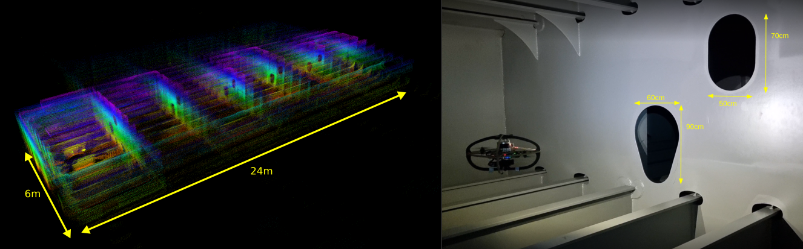 

| | |
| ---- | ---- |
| Description | Autonomous exploration of `6` compartments of the double-bottom section of **level 4** of the ballast tank. The robot passes through extremely narrow manholes of dimensions `0.7 x 0.5m`. |
| Mission Time | 200s |
| Light Conditions | Onboard   - Yes |
|                  | External  - No (only headlights of people present in the tank) |
|                  | Note: Reflection of onboard lights on the metal surfaces can be seen in some frames. |

[**Link to DATASET**](https://ntnu.box.com/s/1dwh2a15b5dir82plwquvtczgfko8v8l)

#### Manual Flight 1

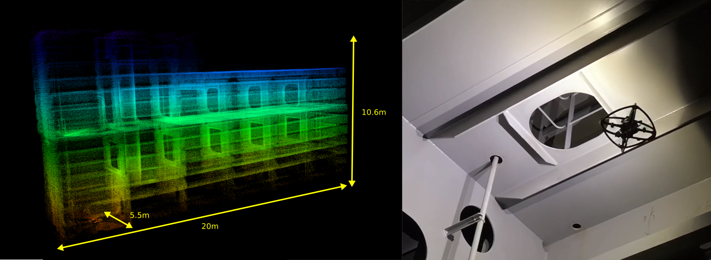

| | |
| ---- | ---- |
| Description | The robot took off from **level 3**, was flown across **level 3**, flown up to **level 2** through a manhole, and flown across **level 2** to map it. |
| Mission Time | 258s |
| Light Conditions | Onboard   - Yes |
|                  | External  - No (only headlights of people present in the tank) |
|                  | Note: Reflection of onboard lights on the metal surfaces can be seen in some frames. |

[**Link to DATASET**](https://ntnu.box.com/s/oocr4dd7aiu8jhujjqi2qcmu027qxm8f)

#### Manual Flight 2

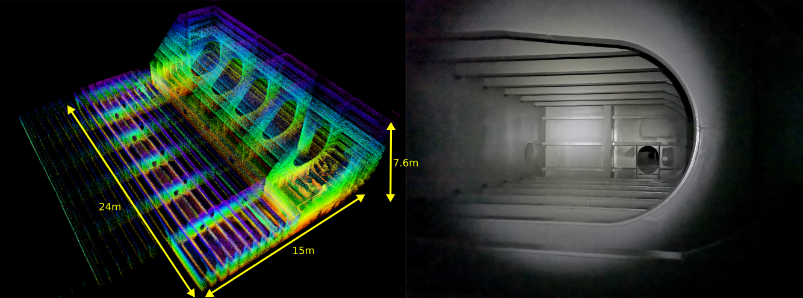

| | |
| ---- | ---- |
| Description | The robot was flown through the bilge and double-bottom section of **level 4**. |
| Mission Time | 275s |
| Light Conditions | Onboard   - Yes |
|                  | External  - No (only headlights of people present in the tank) |
|                  | Note: Reflection of onboard lights on the metal surfaces can be seen in some frames. |

[**Link to DATASET**](https://ntnu.box.com/s/rsdrwc8dhil719vtt20k6mllv0d58phl)

### Oil Tanker ([Whole Dataset](https://ntnu.box.com/s/0wryg5g1yvve04zwgsh446lukvn59623))

The dataset covers missions across two different sections of the ballast tank. The missions involve autonomous exploration and inspection missions. The compartments of this ballast tank are much narrower that the earlier ones.

#### Autonomous Mission 1

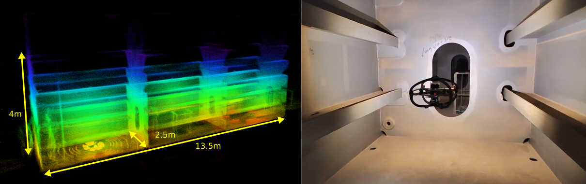

| | |
| ---- | ---- |
| Description | Autonomous exploration and inspection of `3` compartments of the side tank section of the ballast tank. The robot passes through manholes of dimensions `1.2 x 0.6m`. |
| Mission Time | 214s |
| Light Conditions | Onboard   - No |
|                  | External  - No (only headlights of people present in the tank) |

[**Link to DATASET**](https://ntnu.box.com/s/kqh0864j2ux7iz3a334qvxwu2hrafiif)

#### Autonomous Mission 2

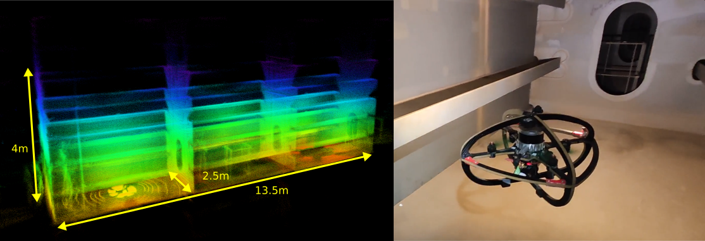

| | |
| ---- | ---- |
| Description | Autonomous exploration and inspection of `3` compartments of the side tank section of the ballast tank. The robot passes through manholes of dimensions `1.2 x 0.6m`. |
| Mission Time | 216s |
| Light Conditions | Onboard   - No |
|                  | External  - No (only headlights of people present in the tank) |

[**Link to DATASET**](https://ntnu.box.com/s/ewwyrdiq9d0g4eda2v3ngi1svky7pabc)

#### Autonomous Mission 3

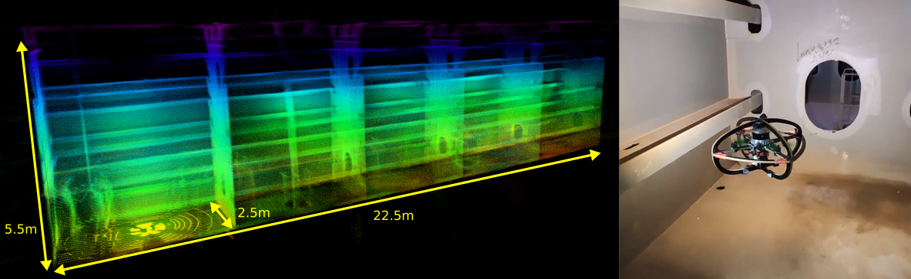

| | |
| ---- | ---- |
| Description | Autonomous exploration and inspection of `5` compartments of the side tank section of the ballast tank. The robot passes through narrow manholes of dimensions `0.8 x 0.6m`. |
| Mission Time | 354s |
| Light Conditions | Onboard   - Yes |
|                  | External  - No (only headlights of people present in the tank) |
|                  | Note: Reflection of onboard lights on the metal surfaces can be seen in some frames. |

[**Link to DATASET**](https://ntnu.box.com/s/rg6lzeo4lk31mui3uda2g4elizihsrh1)

#### Autonomous Mission 4

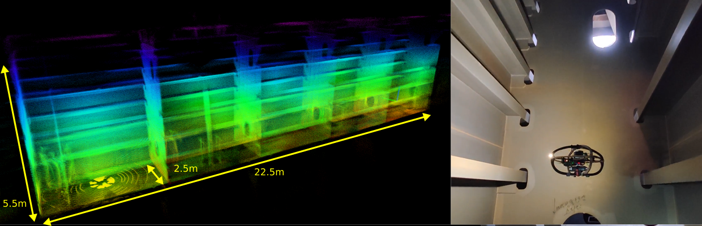 

| | |
| ---- | ---- |
| Description | Autonomous exploration and inspection of `5` compartments of the side tank section of the ballast tank. The robot passes through narrow manholes of dimensions `0.8 x 0.6m`. |
| Mission Time | 360s |
| Light Conditions | Onboard   - Yes |
|                  | External  - No (only headlights of people present in the tank) |
|                  | Note: Reflection of onboard lights on the metal surfaces can be seen in some frames. |

[**Link to DATASET**](https://ntnu.box.com/s/o7gdl2jg91cm9vy6qq5ru65o4qvzakqj)

#### Autonomous Mission 5

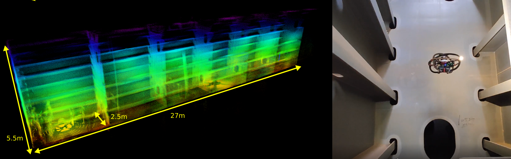

| | |
| ---- | ---- |
| Description | Autonomous exploration and inspection of `6` compartments of the side tank section of the ballast tank. The robot passes through narrow manholes of dimensions `0.8 x 0.6m`. |
| Mission Time | 370s |
| Light Conditions | Onboard   - Yes |
|                  | External  - No (only headlights of people present in the tank) |
|                  | Note: Reflection of onboard lights on the metal surfaces can be seen in some frames. |

[**Link to DATASET**](https://ntnu.box.com/s/tsjdnqcx8ln58jfre1bh2ytqozeh6hgs)
