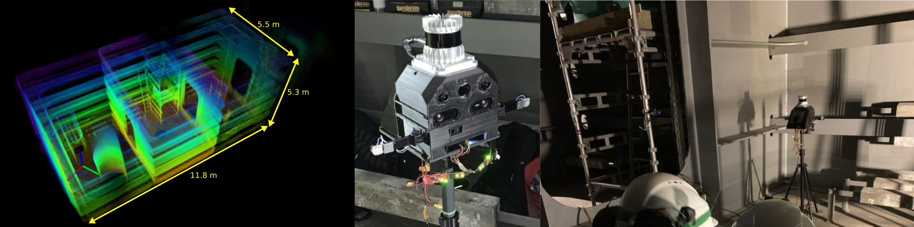

# Dataset from Mjolnir

Mjolnir was deployed FPSO1. Each dataset involves Mjolnir being picked up and carried across multiple compartments of a Ballast Tank on a single level.

## Topics in the dataset

### Sensors:

| Sensor  | Topic                   | Datatype                  | Rate |
| ---     | ---                     | ---                       | --- |
| LiDAR   | `/os_cloud_node/points` | `sensor_msgs/PointCloud2` | `10 Hz` |
|    | `/os_cloud_node/lidar_packets` | `ouster_ros/PacketMsg` | - |
|    | `/os_cloud_node/imu_packets` | `ouster_ros/PacketMsg` | - |
| Monochrome Camera Left | `/blackfly_left/blackfly_left`       | `sensor_msgs/Image`       | `20 Hz` |
|  | `/blackfly_left/blackfly_left_mask`       | `sensor_msgs/Image`       | `20 Hz` |
|  | `/blackfly_left/camera_info`       | `sensor_msgs/CameraInfo`       | `20 Hz` |
| Monochrome Camera Right | `/blackfly_right/blackfly_right`       | `sensor_msgs/Image`       | `20 Hz` |
|  | `/blackfly_right/blackfly_right_maskt`       | `sensor_msgs/Image`       | `20 Hz` |
|  | `/blackfly_right/camera_info`       | `sensor_msgs/CameraInfo`       | `20 Hz` |
| IMU (compensated) | `/vectornav_node/imu`       | `sensor_msgs/Imu`       | `200 Hz` |
| IMU (uncompensated) | `/vectornav_node/uncomp_imu`       | `sensor_msgs/Imu`       | `200 Hz` |
| Radar Left | `/radar/left/cloud`       | `sensor_msgs/PointCloud2`       | `10 Hz` |
| Radar Right | `/radar/right/cloud`       | `sensor_msgs/PointCloud2`       | `10 Hz` |
| TOF sensor | `/pico_flexx/points`       | `sensor_msgs/PointCloud2`       | `5 Hz` |

**Note: Due to data privacy reasons, the faces of all people in the images are blurred. In order to avoid issues caused by this, a mask image marking the pixels in the corresponding camera images that were blurred is provided on the topic `/blackfly_image_mask/compressed`.**

### Onboard SLAM:
| Description   | Topic                   | Datatype                  | Rate |
| ---           | ---                     | ---                       | --- |
| LiDAR only SLAM (using [[1]](https://ieeexplore.ieee.org/document/9213865)) | `/compslam/odometry` | `nav_msgs/Odometry` | `5 Hz` |
| Robot's path | `/laser_mapping_path` | `nav_msgs/Path` | `5 Hz` |

### Other:
| Topic | Description | Datatype                  |
| ---           | ---                     | ---                       |
| `/tf_static` | Transformations between each the frames of all sensors | tf2_msgs/TFMessage |

### Intrinsics and Extrinsics:
+ **The camera instrinsics calibration is published on the topic `/<camera name>/camera_info` as `sensor_msgs/CameraInfo` messages.**   
+ **All the transformations between the sensor are available as [`tf/tfMessage`](https://docs.ros.org/en/noetic/api/tf/html/msg/tfMessage.html) on the topic `/tf_static`.**

## Data Description

### FPSO1 ([Whole Dataset](https://ntnu.box.com/s/nbdcb6odr9oub9u7s5aq63fpm2g5o64s))
This dataset was collected on the 1st level of the FPSO1. 

##### For all missions:

|  |  |
| ---- | ---- |
| Light Conditions | Onboard   - Yes |
|                  | External  - Yes |
|                  | Note: Bright external light shines into the camera in several frames. |

#### Mission 1

| Description | Handheld collection walking through multiple compartments |
| ---- | ---- |
| Mission Time |  268s |

[**Link to DATASET**](https://ntnu.box.com/s/xrzipkh9j9g5prhxtka0g8j8tltg5bx2)

#### Mission 2

| Description | Handheld collection walking through multiple compartments |
| ---- | ---- |
| Mission Time |  373s |

[**Link to DATASET**](https://ntnu.box.com/s/om85uqm9cbe1pykwvna7zkzoc1p2cmw8)

#### Mission 3

| Description | Handheld collection walking through multiple compartments |
| ---- | ---- |
| Mission Time | 357s |

[**Link to DATASET**](https://ntnu.box.com/s/agz2hxz0igyaipck5ijmew5yjt1i78hi)

#### Mission 4

| Description | Handheld collection walking through multiple compartments |
| ---- | ---- |
| Mission Time | 395s |

[**Link to DATASET**](https://ntnu.box.com/s/52qtbdhtlu5s7jrfr20jw1t6f7982045)
